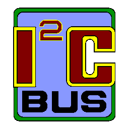

# ioBroker adapter for I2C

   

Communicates with devices connected to the local system using the I2C bus.

This adapter should work on Linux boards like the Raspberry Pi, C.H.I.P., BeagleBone or Intel Edison. 

## Install

Before installing, please read the [installation guide of the i2c-bus module](https://www.npmjs.com/package/i2c-bus#installation).

Especially make sure, that you have properly configured and enabled I2C on your system (if needed):
* [Configuring I2C on the Raspberry Pi](https://github.com/fivdi/i2c-bus/blob/master/doc/raspberry-pi-i2c.md)
* [Configuring I2C on the Intel Edison Arduino Base Board](https://github.com/fivdi/i2c-bus/blob/master/doc/edison-adruino-base-board-i2c.md)

After you have enabled and configured I2C, you can install this adapter via ioBroker Admin:
1. Start the adapter (it must run for the discovery to work)
2. Open instance config dialog
3. Press the "Search Devices" button to discover all connected I2C devices - this will take some time, be patient!
4. Configure all found devices in their respective tabs.
5. Save the configuration (this will restart the adapter)

## Configuration

### Bus Number

This is the number of the I2C bus/adapter to open, 0 for /dev/i2c-0, 1 for /dev/i2c-1, ...

On Raspberry Pi 3, this is "1".

## Supported Devices

The following devices are currently supported. The numbers in parenthesis are the known addresses of the device in hexadecimal format (without the read bit).

### ADS1015 (48-4B)

Texas Instruments 4x 3.3-kSPS, 12-Bit ADCs with Internal Reference.

### ADS1115 (48-4B)

Texas Instruments 4x 860-SPS, 16-Bit ADCs with Internal Reference.

### BME280 (76, 77)

Bosch Digital Humidity, Pressure and Temperature Sensor.

### MCP23008 8-Bit I/O Expander (20-27)

Microchip 8-Bit I/O Expander with Serial Interface.

### MCP23017 16-Bit I/O Expander (20-27)

Microchip 16-Bit I/O Expander with Serial Interface.

### PCF8574 8-Bit I/O Expander (20-27)

Texas Instruments Remote 8-Bit I/O Expander for I2C Bus.

### PCF8574A 8-Bit I/O Expander (38-3F)

Texas Instruments Remote 8-Bit I/O Expander for I2C Bus.

## Compatibility

Compatibility has been tested with Raspberry Pi 3.

## Bug Reports and Feature Requests

Please use the GitHub repository to report any bugs or request new features.

If you require a missing devcies, please provide the type of IC (brand, model, ...) and its address(es) as reported in the adapter configuration.

## TODO
* Support interrupts instead of only polling for MCP230xx and PCF8574

## Changelog

### 0.0.6 (2019-03-17)
* (UncleSamSwiss) Added support for BME280.
* (UncleSamSwiss) Added support for ADS1015 / ADS1115.

### 0.0.5 (2019-01-12)
* (UncleSamSwiss) Added support for MCP23008.

### 0.0.4 (2018-07-23)
* (UncleSamSwiss) Improved stability of MCP23017.
* (Apollon77) Latest ioBroker utils and testing including node 10.

### 0.0.3 (2017-11-12)
* (UncleSamSwiss) Added support for MCP23017.

### 0.0.2 (2017-07-30)
* (UncleSamSwiss) Added support for inverting PCF8574 inputs and outputs.

### 0.0.1 (2017-07-27)
* (UncleSamSwiss) Initial version

## Thanks

This project is based on the [i2c-bus](https://www.npmjs.com/package/i2c-bus) NPM module. Thanks to fivdi for his great module!

## Third Party Licenses

### BME280
The BME280 code is based on https://github.com/skylarstein/bme280-sensor:

MIT License

Copyright (c) 2016 Skylar Stein

Permission is hereby granted, free of charge, to any person obtaining a copy
of this software and associated documentation files (the "Software"), to deal
in the Software without restriction, including without limitation the rights
to use, copy, modify, merge, publish, distribute, sublicense, and/or sell
copies of the Software, and to permit persons to whom the Software is
furnished to do so, subject to the following conditions:

The above copyright notice and this permission notice shall be included in all
copies or substantial portions of the Software.

THE SOFTWARE IS PROVIDED "AS IS", WITHOUT WARRANTY OF ANY KIND, EXPRESS OR
IMPLIED, INCLUDING BUT NOT LIMITED TO THE WARRANTIES OF MERCHANTABILITY,
FITNESS FOR A PARTICULAR PURPOSE AND NONINFRINGEMENT. IN NO EVENT SHALL THE
AUTHORS OR COPYRIGHT HOLDERS BE LIABLE FOR ANY CLAIM, DAMAGES OR OTHER
LIABILITY, WHETHER IN AN ACTION OF CONTRACT, TORT OR OTHERWISE, ARISING FROM,
OUT OF OR IN CONNECTION WITH THE SOFTWARE OR THE USE OR OTHER DEALINGS IN THE
SOFTWARE.

### ADS1x15
The ADS1x15 code is based on https://github.com/alphacharlie/node-ads1x15/blob/master/index.js

node-ads1x15 itself is based on https://github.com/adafruit/Adafruit_Python_ADS1x15

The MIT License (MIT)

Copyright (c) 2016 Adafruit Industries

Permission is hereby granted, free of charge, to any person obtaining a copy
of this software and associated documentation files (the "Software"), to deal
in the Software without restriction, including without limitation the rights
to use, copy, modify, merge, publish, distribute, sublicense, and/or sell
copies of the Software, and to permit persons to whom the Software is
furnished to do so, subject to the following conditions:

The above copyright notice and this permission notice shall be included in all
copies or substantial portions of the Software.

THE SOFTWARE IS PROVIDED "AS IS", WITHOUT WARRANTY OF ANY KIND, EXPRESS OR
IMPLIED, INCLUDING BUT NOT LIMITED TO THE WARRANTIES OF MERCHANTABILITY,
FITNESS FOR A PARTICULAR PURPOSE AND NONINFRINGEMENT. IN NO EVENT SHALL THE
AUTHORS OR COPYRIGHT HOLDERS BE LIABLE FOR ANY CLAIM, DAMAGES OR OTHER
LIABILITY, WHETHER IN AN ACTION OF CONTRACT, TORT OR OTHERWISE, ARISING FROM,
OUT OF OR IN CONNECTION WITH THE SOFTWARE OR THE USE OR OTHER DEALINGS IN THE
SOFTWARE.